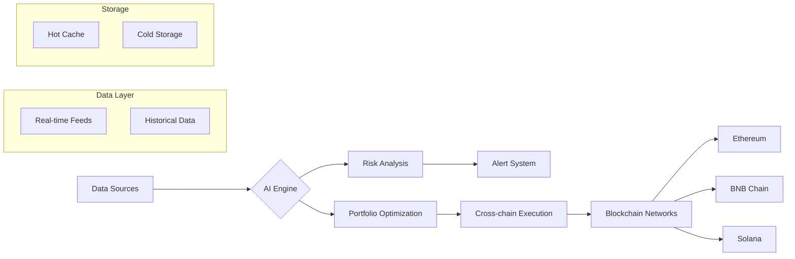

# Bella Fund AI - Intelligent Cross-chain Investment Platform 🚀

## Table of Contents
- [Overview](#overview-)
- [Features](#features-)
- [Architecture](#technical-architecture-)
- [Supported Blockchains](#supported-blockchains-)
- [Installation](#installation-)
- [Development](#development-)
- [Contributing](#contributing-)
- [Team](#team-)
- [Links](#official-links-)

## Overview 📈
Bella Fund is an AI-driven investment platform combining decentralized finance and machine learning to provide:

- **Real-time Crypto Asset Scoring** (`services/ai_scoring.py`)
- **Cross-chain Portfolio Management** (`contracts/CrossChainBridge.sol`)
- **Institutional-grade Risk Analysis** (`services/alert_correlator.py`)
- **NFT-based Investment Certificates** (`contracts/NFTCard.sol`)

## Features 🔥
### Core Components
| Module | Description | Status |
|--------|-------------|--------|
| `ai_scoring.py` | AI prediction models analyzing 50+ market indicators | ✅ Production |
| `storage_optimizer.py` | Intelligent multi-cloud storage management | ✅ Production |
| `CrossChainBridge.sol` | Secure asset transfers between chains | 🚧 Beta |
| `model_training.py` | ML pipeline for continuous model improvement | ✅ Production |

### Implemented Features
- Real-time market monitoring (`services/background_tasks.py`)
- Risk detection system (`services/alert_correlator.py`)
- Cost-optimized storage (`app/middleware/storage_optimizer.py`)
- Governance framework (`contracts/GovernanceToken.sol`)

## Technical Architecture 🧠

## Supported Blockchains ⛓️
| Chain       | Status  | Features |
|-------------|---------|----------|
| Ethereum    | ✅ Live | Asset scoring, NFT cards |
| BNB Chain   | ✅ Live | Low-cost transactions |
| Solana      | 🚧 Beta | High-speed trading, NFT minting |

## Installation 📦

## Development 🛠

## Contributing 🤝

## Team 🧑‍💻

## Links 🔗
