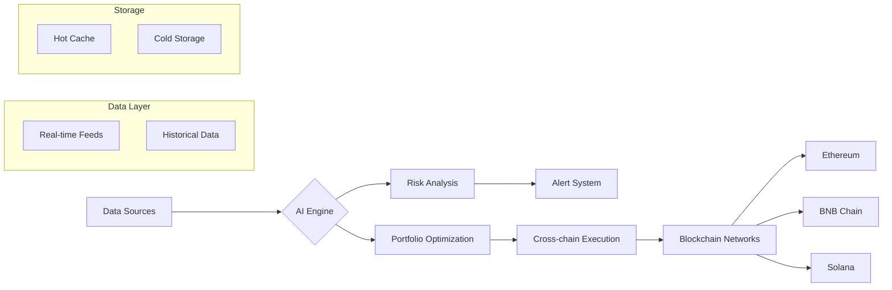

# Bella Fund AI - Intelligent Cross-chain Investment Platform 🚀


[](https://opensource.org/licenses/MIT)
[](https://github.com/bellafund/core-system/actions)
[](https://x.com/BellaFund_AI)

## Table of Contents
- [Overview](#overview-)
- [Features](#features-)
- [Architecture](#technical-architecture-)
- [Supported Blockchains](#supported-blockchains-)
- [Installation](#installation-)
- [Development](#development-)
- [Contributing](#contributing-)
- [Team](#team-)
- [Links](#official-links-)

## Overview 📈
Bella Fund is an AI-driven investment platform combining decentralized finance and machine learning to provide:

- **Real-time Crypto Asset Scoring** (`services/ai_scoring.py`)
- **Cross-chain Portfolio Management** (`contracts/CrossChainBridge.sol`)
- **Institutional-grade Risk Analysis** (`services/alert_correlator.py`)
- **NFT-based Investment Certificates** (`contracts/NFTCard.sol`)

## Features 🔥
### Core Components
| Module | Description | Status |
|--------|-------------|--------|
| `ai_scoring.py` | AI prediction models analyzing 50+ market indicators | ✅ Production |
| `storage_optimizer.py` | Intelligent multi-cloud storage management | ✅ Production |
| `CrossChainBridge.sol` | Secure asset transfers between chains | 🚧 Beta |
| `model_training.py` | ML pipeline for continuous model improvement | ✅ Production |

### Implemented Features
- Real-time market monitoring (`services/background_tasks.py`)
- Risk detection system (`services/alert_correlator.py`)
- Cost-optimized storage (`app/middleware/storage_optimizer.py`)
- Governance framework (`contracts/GovernanceToken.sol`)

## Technical Architecture 🧠



## Supported Blockchains ⛓️
| Chain       | Status  | Features |
|-------------|---------|----------|
| Ethereum    | ✅ Live | Asset scoring, NFT cards |
| BNB Chain   | ✅ Live | Low-cost transactions |
| Solana      | 🚧 Beta | High-speed trading, NFT minting |

## Installation 📦
```bash
# Clone the repository
git clone git@github.com:BellaFund-AI/BellaFund.git

# Install dependencies
pip install -r requirements.txt

# Setup environment variables
cp .env.example .env
```

## Development 🛠
### Prerequisites
- Python 3.8+
- Node.js 16+
- Solidity 0.8.0+

### Local Development
```bash
# Start development server
python manage.py runserver

# Run tests
pytest tests/

# Deploy smart contracts
npx hardhat deploy --network testnet
```

## Contributing 🤝
We welcome contributions! Please follow these steps:

1. Fork the repository
2. Create your feature branch (`git checkout -b feature/amazing-feature`)
3. Commit your changes (`git commit -m 'feat: Add amazing feature'`)
4. Push to the branch (`git push origin feature/amazing-feature`)
5. Open a Pull Request

For detailed guidelines, please see our [Contributing Guide](CONTRIBUTING.md).

## Team 🧑‍💻
- **AI Research** - [BellaFund AI Team](https://github.com/orgs/BellaFund-AI/teams/ai-research)
- **Blockchain Development** - [BellaFund Engineering](https://github.com/orgs/BellaFund-AI/teams/engineering)
- **Product & Design** - [BellaFund Product](https://github.com/orgs/BellaFund-AI/teams/product)

## Links 🔗
- [Website](https://bellafund.ai)
- [Documentation](https://docs.bellafund.ai)
- [Twitter](https://twitter.com/BellaFund_AI)
- [Discord](https://discord.gg/bellafund)
- [Blog](https://blog.bellafund.ai)
